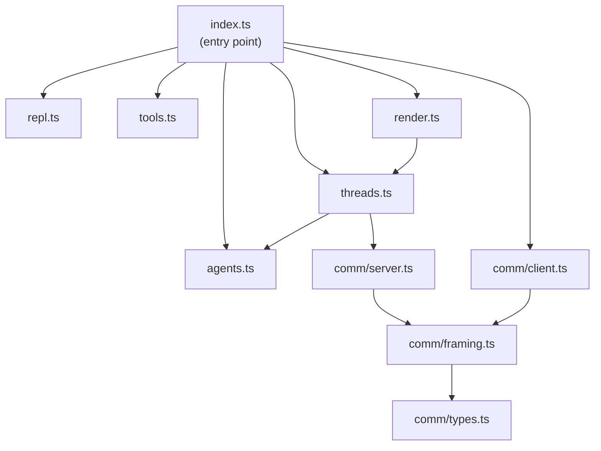
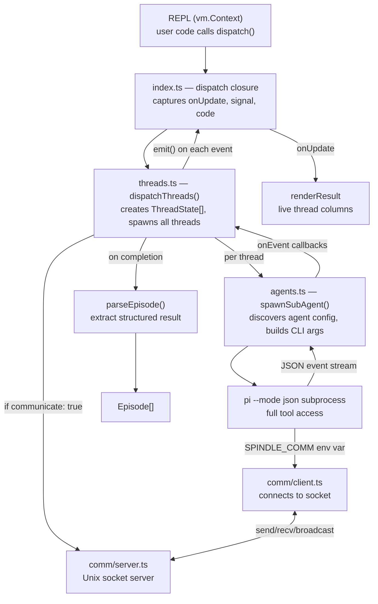
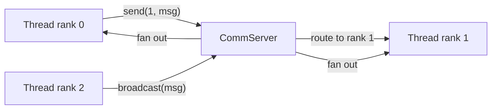
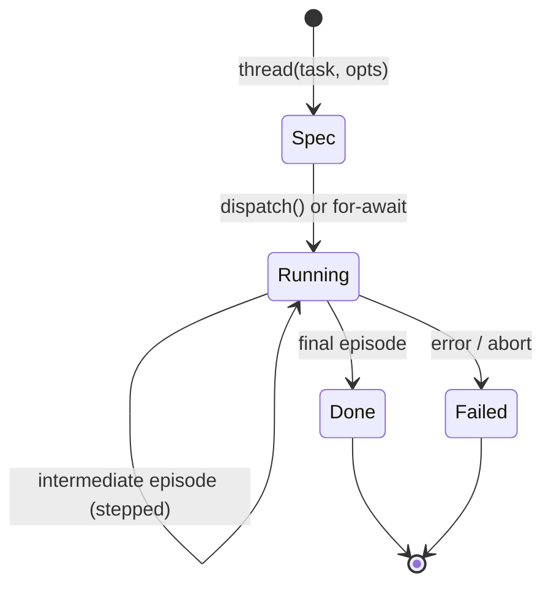
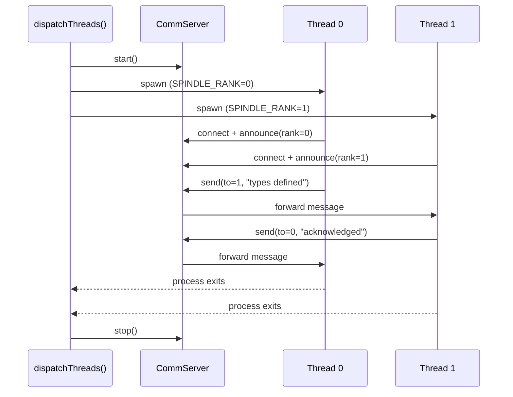

# Spindle Architecture

Spindle is a pi extension that adds a persistent JavaScript REPL with sub-agent orchestration. It registers two tools (`spindle_exec`, `spindle_status`) and one command (`/spindle`), giving the host agent a programmable runtime for spawning and coordinating sub-agents.

## Module Map

| File | Lines | Responsibility |
|---|---:|---|
| `src/index.ts` | 423 | Extension entry point. Registers tools and commands, initializes the REPL, wires closures for dispatch/thread, manages session lifecycle and comm client setup. |
| `src/repl.ts` | 187 | Sandboxed `vm.Context` REPL. Executes user code in sloppy-mode async IIFEs. Handles output capture, truncation, variable introspection, and reset. |
| `src/tools.ts` | 110 | Wraps pi's built-in tools (`read`, `bash`, `grep`, `find`, `edit`, `write`, `ls`) into simple `(args) → string` functions for REPL use. Provides `load`/`save` for bulk file I/O. |
| `src/agents.ts` | 344 | Spawns sub-agents as `pi --mode json` child processes. Discovers agent configs from `~/.pi/agent/agents/` and `.pi/agents/`. Streams JSON events, tracks usage, handles abort/timeout. |
| `src/threads.ts` | 546 | Core orchestration. Defines `ThreadSpec` (lazy async generators), `dispatch` (parallel execution), episode parsing, and the comm server lifecycle for inter-thread messaging. |
| `src/render.ts` | 265 | TUI rendering for tool calls and results. Formats code highlighting, thread columns, dispatch progress, status output. |
| `src/comm/server.ts` | 161 | Unix socket server for thread-to-thread communication. Routes point-to-point and broadcast messages, queues for not-yet-connected ranks. |
| `src/comm/client.ts` | 110 | Unix socket client. Connects to the comm server, provides `send`/`recv`/`broadcast` with a waiter-based async inbox. |
| `src/comm/framing.ts` | 61 | Length-prefixed framing protocol (4-byte big-endian length + JSON payload). Validates message structure on decode. |
| `src/comm/types.ts` | 7 | `CommMessage` type: `announce`, `send`, or `broadcast` with rank-based addressing. |

**Total: ~2,200 lines.**

## Module Dependencies

## Data Flow: `dispatch` Call

When REPL code calls `await dispatch([thread(...), thread(...)], opts)`:

### Comm message routing

## Key Design Decisions

### ThreadSpec as Lazy AsyncGenerator

`thread(task, opts)` does not start a subprocess. It returns a `ThreadSpec` — a branded object that implements the `AsyncGenerator` protocol but defers work until iteration begins. This lets users build arrays of specs declaratively and hand them to `dispatch()`, which controls when and how they execute.

The generator is created on first `.next()` or `for await...of`. Internally it starts the subprocess, yields intermediate `running` episodes (if stepped mode is on), and yields a final episode parsed from the complete result.

`dispatch()` does not use the generator protocol directly — it calls `spawnSubAgent()` itself for tighter control over event handling and comm wiring. The generator path exists for direct consumption (`for await (const ep of thread(...))`) outside of `dispatch`.

### Sloppy-Mode Variable Persistence

The REPL wraps every execution in `(async () => { ... })()` and runs it in a `vm.Context`. Because code is not in strict mode, bare assignments like `x = 5` write to the context's global scope rather than throwing a `ReferenceError`. This means variables persist across `spindle_exec` calls without requiring `let`/`const` declarations — a deliberate trade-off favoring conversational ergonomics over strict scoping.

The `getVariables()` method enumerates context keys, filters out builtins, and returns type/preview info for `spindle_status`. `reset()` creates a fresh context but re-injects the built-in tool functions.

### Episode Parsing: Last Match Wins

`parseEpisode()` extracts the structured result from a sub-agent's response text by finding `<episode>...</episode>` blocks. It deliberately takes the **last** match, not the first. This handles a common case: agents reading Spindle's own source code or quoting the episode template will include the template block in their output. The actual agent-generated episode always appears at the end of the response, so last-match semantics correctly skip quoted templates.

When no episode block is found, a fallback episode is synthesized from the exit code and the first 500 characters of output.

### Stepped Episodes

Threads can opt into `stepped: true` mode, which appends a different system prompt suffix instructing the sub-agent to emit intermediate `<episode>` blocks with `status: running` at natural milestones. The generator yields these as they arrive, and the dispatch event handler tracks them on `ThreadState.episode` for live progress display. Only `running` episodes are yielded mid-stream — terminal statuses from the event stream are ignored in favor of the final `parseEpisode()` call which carries accurate cost, duration, and tool-call counts.

### Comm Server Lifecycle

Thread communication is opt-in (`dispatch([...], { communicate: true })`). When enabled:

1. **Server startup.** `dispatchThreads()` creates a `CommServer` that listens on a Unix domain socket in a temp directory. The socket path is injected into each sub-agent's environment as `SPINDLE_COMM`, along with `SPINDLE_RANK` (0-indexed) and `SPINDLE_SIZE`.

2. **Client connection.** When a sub-agent's Spindle extension initializes (`session_start`), it checks for these env vars. If present, it creates a `CommClient`, connects to the socket, and registers three tools: `spindle_send`, `spindle_recv`, `spindle_broadcast`.

3. **Message routing.** The server uses a rank-based addressing scheme. Clients announce their rank on connect. `send` routes point-to-point; `broadcast` fans out to all other ranks. Messages for not-yet-connected ranks are queued (up to 1,000 per rank).

4. **Framing.** Messages use a simple length-prefixed binary protocol: 4-byte big-endian length followed by JSON payload. The `FrameDecoder` class handles streaming reassembly and validates message structure.

5. **Cleanup.** When all threads complete (or on abort), `dispatchThreads()` calls `commServer.stop()`, which destroys all sockets, clears queues, and removes the temp directory.

### Sub-Agent Spawning

Sub-agents are full `pi` processes launched with `--mode json` (structured event streaming) and `--no-session` (no persistent session state). The spawner:

- Resolves agent configs from user (`~/.pi/agent/agents/`) and project (`.pi/agents/`) directories
- Writes system prompt suffixes to temp files (cleaned up in `finally`)
- Optionally passes `--extension <spindle-src>/index.ts` for recursive Spindle (sub-agents get their own REPL)
- Parses the JSON event stream for `tool_execution_start`, `tool_execution_end`, `message_end`, and `tool_result_end` events
- Tracks cumulative token usage across turns
- Handles abort (SIGTERM → 5s grace → SIGKILL) and timeout

### Extension Entry & Tool Registration

`index.ts` registers everything at load time but defers REPL creation to first use. The `spindle_exec` tool handler:

1. Sets `currentOnUpdate`, `currentSignal`, `currentCode` on the module scope
2. These closures are captured by `dispatch()` and `llm()` when user code calls them
3. After execution, episodes are extracted from `__lastEpisodes` (set by the dispatch closure)
4. Cumulative usage stats are tracked across all `spindle_exec` calls in a session

This closure-threading pattern avoids passing context through the REPL's `vm.Context` while keeping the user-facing API clean (`dispatch([...])` with no extra arguments).
